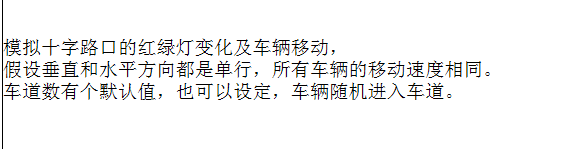
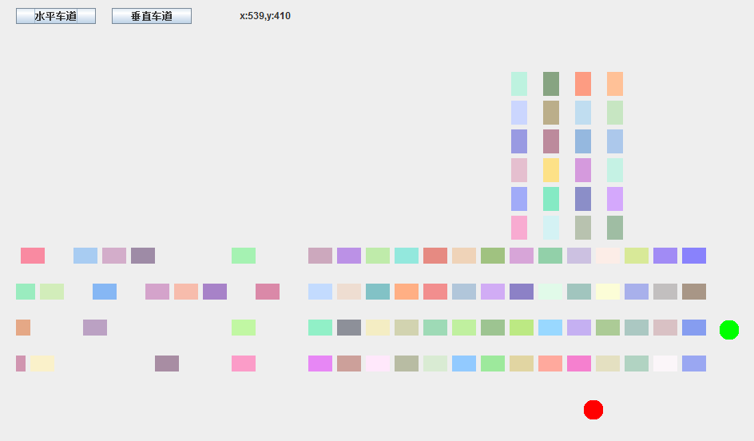

# Crossroads
## Java final work
### 要求  

### 进度
#### 车道
* 可以在程序中更改车道数目，布局会以此为基础乘以不同系数变动
* 运动时实现车的添加和移除
* 红灯时，有空档的车会继续运行和添加，直到和前车距离最小  
* 随机颜色，随机生成车辆  
* 水平车道，垂直车道的运行
* 两个按钮可以切换两个车道的运行状态
* 黄灯车道运行停止，绿灯开始运行
* 线程  
#### 布局  
* 最上面两个按钮控制的是车道运行和信号灯，适配还有一点问题  
* 有鼠标滑动坐标，布局取得坐标更加方便  
#### 未完成
* 还没做背景  
* 车道运行按钮和信号灯，适配还有一点问题  
* 还想做一个文本field，作为车道数的更改  
* 还想做一个Label提示两个车道的状态
* 竖直车道的isRunning为false只是为了方便能改就改
* 红绿灯的位置争取可以用相乘系数改变  
* 想让红绿灯切换的时间差有区别  
* 具体代码将在30日以后上传  

