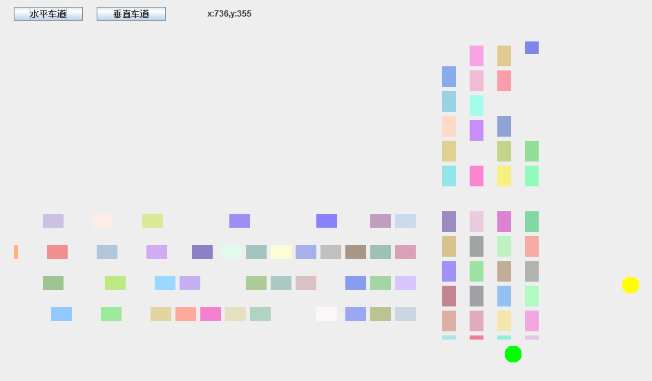

# Crossroads
## Java final work
### 要求  

### __进度__
__车道__
* 可以在程序中更改车道数目，布局会以此为基础乘以不同系数变动
* 运动时实现车的添加和移除
* 红灯时，有空档的车会继续运行和添加，直到和前车距离最小  
* 随机颜色，随机生成车辆  
* 水平车道，垂直车道的运行
* 两个按钮可以切换两个车道的运行状态
* 黄灯车道运行停止，绿灯开始运行
* 线程  
* 车道数目由TextField控制，旁边有按钮，按一次即失效  

__布局__
* 最上面两个按钮控制的是车道运行和信号灯
* 文本框控制车道数目，背景（车道及线根据车道数改变）
* 文本框旁按钮是开始键，一次即失效
* 有鼠标滑动坐标，布局取得坐标更加方便  
* 完成水平竖直车道的控制，排除错误  
* 红绿灯位置不能改变  
* 红绿灯切换时间差已改变  
* 背景画完了，根据车道数目改变  
* 旁边有提示车道、红绿灯、error、车道数目状态的Label  
* 车道数目在3、4、5之间，输入不是数字，或超出范围，都会在上条的Label中显示  

__未完成__
* 根据车道数目改变红绿灯切换时间  
* 人工控制两个车道的时候更智能一点
* 具体代码将在30日以后上传  
  
  
  

### Update  
__2016.11.10__  
_车道_  
* 车道数目由TextField控制，旁边有按钮，按一次即失效  
* 背景画完了，根据车道数目改变  
* 旁边有提示车道、红绿灯、error、车道数目状态的Label  
* 车道数目在3、4、5之间，输入不是数字，或超出范围，都会在上条的Label中显示  
_布局_  
* 完成水平竖直车道的控制，排除错误  
* 红绿灯位置不能改变  
* 红绿灯切换时间差已改变  
_未完成_  
* 根据车道数目改变红绿灯切换时间  
__2016.11.06__    
_车道_  
* 可以在程序中更改车道数目，布局会以此为基础乘以不同系数变动
* 运动时实现车的添加和移除
* 红灯时，有空档的车会继续运行和添加，直到和前车距离最小
* 随机颜色，随机生成车辆
* 水平车道，垂直车道的运行
* 两个按钮可以切换两个车道的运行状态
* 黄灯车道运行停止，绿灯开始运行
* 线程
_布局_  
* 最上面两个按钮控制的是车道运行和信号灯，适配还有一点问题
* 有鼠标滑动坐标，布局取得坐标更加方便
_未完成_  
* 还没做背景
* 车道运行按钮和信号灯，适配还有一点问题
* 还想做一个文本field，作为车道数的更改
* 还想做一个Label提示两个车道的状态
* 竖直车道的isRunning为false只是为了方便能改就改
* 红绿灯的位置争取可以用相乘系数改变
* 想让红绿灯切换的时间差有区别
  
  
__2016.11.04__  
* 水平车道，垂直车道的运行
* 布局成功
* 两个按钮实现车道的运行和暂停
* 暂停时，有空档的车会继续运行和添加
* 随机颜色，随机生成车辆
* 线程
* 还没做信号灯和背景  
  
  
  